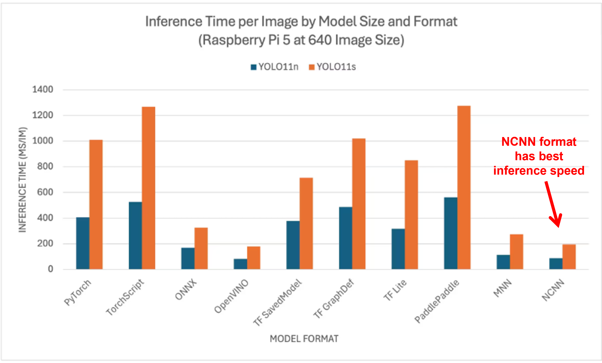

````markdown
# 🦾 YOLO NCNN Object Detection on Raspberry Pi 5

This project demonstrates **high-performance object detection** using **YOLOv11 models** exported to the **NCNN format**, optimized to run on edge devices like the **Raspberry Pi 5**.

It provides a Python-based interface (`yolo_detect.py`) to detect objects from:
- 📸 USB/CSI cameras
- 🎞️ Video files
- 🖼️ Directories of images

---

## 📊 Why Use NCNN?

**NCNN** is a high-performance neural network inference framework specifically designed for mobile and embedded platforms like **Raspberry Pi**.

From benchmark tests (see `yolo-format-speeds.png`):

- NCNN has **the fastest inference speed** among all formats (PyTorch, ONNX, TFLite, etc.)
- It uses **lower memory** and **CPU**, making it ideal for real-time applications.

---

## 🧰 Requirements

Ensure your Raspberry Pi (preferably Pi 5) is set up with the following:

### 🔗 System Dependencies

Install system packages:
```bash
sudo apt update && sudo apt upgrade -y
sudo apt install git python3 python3-opencv python3-pip libopencv-dev wget
````

Optional for camera support:

```bash
sudo apt install python3-picamera2 libcamera-apps
```

### 📦 Python Libraries

Install Python dependencies:

```bash
pip install ultralytics opencv-python numpy flask
```

### 🧠 YOLOv11 + NCNN Tools

Make sure to clone or install:

* [Ultralytics YOLOv11](https://github.com/ultralytics/ultralytics)
* [Tencent NCNN](https://github.com/Tencent/ncnn) – follow official build instructions or use precompiled versions.

---

## 📁 Folder Structure

```plaintext
crow-main/
├── best.pt                       # Original YOLOv11 model
├── cam.py                        # (Optional) Script for camera capture
├── cam-ras.py                    # (Optional) Script for Raspberry Pi camera
├── yolo_detect.py                # Python detection script using NCNN
├── yolo_v11_final.ipynb          # Training / experimentation notebook
├── yolo-format-speeds.png        # Benchmark comparison image
├── README.md                     # You are reading it now!
├── yolo11n_ncnn_model.param      # Exported NCNN model file
├── yolo11n_ncnn_model.bin        # Exported NCNN model weights
└── img_dir/
    ├── image1.jpg
    ├── image2.jpg
    └── ...
```

---

## 🚀 Step-by-Step Guide

### ✅ 1. Export YOLOv11 Model to NCNN Format

Use Ultralytics to convert your `.pt` model:

```bash
yolo export model=best.pt format=ncnn
```

This will create:

* `best_ncnn_model.param`
* `best_ncnn_model.bin`

Place both files in the project directory.

---

### ✅ 2. Download the Detection Script

If not already present:

```bash
wget https://ejtech.io/code/yolo_detect.py
```

> This script handles loading the NCNN model, preprocessing input, and performing inference.

---

### ✅ 3. Run the Detector

#### a. 🔴 Live Detection using USB or Pi Camera

```bash
python3 yolo_detect.py --model=best_ncnn_model --source=picamera0 --resolution=640x480
```

* `--model`: prefix of `.param` and `.bin` files
* `--source`: input stream (`picamera0`, `usb0`, etc.)
* `--resolution`: width x height (match model training)

#### b. 🎥 Run on a Video File

```bash
python3 yolo_detect.py --model=best_ncnn_model --source=test_video.mp4
```

#### c. 🖼️ Run on a Directory of Images

```bash
python3 yolo_detect.py --model=best_ncnn_model --source=img_dir
```

> Output will be displayed in a window or optionally saved to disk (modify script).

---

## 🧠 Internals of `yolo_detect.py`

* Loads `.param` and `.bin` NCNN files
* Initializes OpenCV video/image capture
* Applies YOLO inference on each frame
* Post-processes detections (bounding boxes, labels)
* Draws results and displays/saves them

---

## 📷 Raspberry Pi Camera Tips

If using the **Pi Camera Module**, ensure it’s enabled:

```bash
libcamera-hello
```

To test with PiCam:

```bash
python3 yolo_detect.py --source=picamera0
```

If not working, check:

* `libcamera` configuration
* Camera connection
* Permissions

---

## 💡 Notes & Tips

* Use **YOLOv11n or YOLOv11s** for best performance on Raspberry Pi
* Keep image resolution **low (e.g., 640x480)** for faster results
* You may modify `yolo_detect.py` for:

  * Custom drawing styles
  * Saving output
  * Adding logging or performance metrics

---

## 📊 Performance Benchmark (Reference)



**NCNN beats all other formats**, giving real-time performance on Raspberry Pi 5.
---